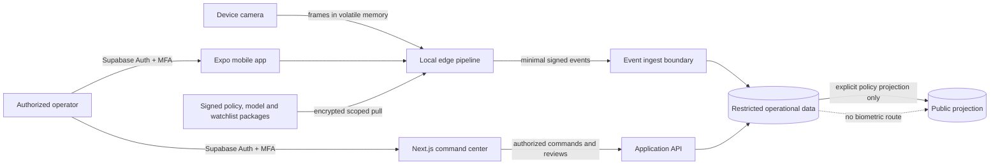

# Architecture 0001: Mobile Edge and Government Control Plane

- Status: planned; no product runtime exists yet
- Date: 2026-08-13
- Applies first to: Specification 0003 synthetic pilot

## Architectural Drivers

- Useful with one operator and one iPhone before community or federation features.
- Raw video and primary inference remain on the edge.
- ALPR/object and biometric data use separate contracts, permissions, retention, and
  review paths.
- Government multi-tenancy is logical for synthetic/approved data and may become
  physically separate per authority or classification.
- Supabase and Vercel are replaceable adapters, not the domain architecture.
- Policy failure, stale packages, ambiguous tenant scope, and incompatible models
  deny processing rather than silently degrade authorization.

## System Context



The diagram shows planned runtime components. Today the repository contains only
specifications, memory tooling, tests, and CI.

## Primary Components

### `apps/mobile` — Expo/React Native

The iPhone app contains field sign-in, node enrollment, readiness, foreground
`Sentry Mode`, health, offline queue visibility, and restricted mobile review. It
uses an Expo development build because the camera pipeline, inference runtime, secure
device identity, and runtime instrumentation require native modules.

`expo-camera` owns the preview and permission flow. Only one preview is mounted. A
native inference adapter receives sampled frames through a bounded buffer; the React
tree never becomes a per-frame message bus. The adapter exposes typed lifecycle,
health, and candidate ports, not raw native objects.

iOS ends camera use when the application backgrounds. The lifecycle coordinator
therefore stops capture, clears volatile frame state, seals or expires queued work,
and reports the node offline. The product never attempts to conceal camera use or
remotely start capture.

### `apps/web` — Next.js

The web app is the desktop command center for deployment setup, event exploration,
candidate review, node fleet health, watchlist governance, policy state, retention,
and audit. Server-side code verifies user sessions and authorization per request.
Privileged mutation routes require `aal2`; a visual route guard is not a security
control.

The UI can be deployed to Vercel for synthetic or formally approved classifications.
Restricted biometric evidence and operational services do not automatically transit
Vercel because the UI uses an application API/provider boundary.

### Shared TypeScript packages

```text
packages/contracts/       versioned envelopes, payloads, errors, and API types
packages/policy/          pure fail-closed authorization and transition decisions
packages/api-client/      generated/typed client with idempotency and pagination
packages/design-tokens/   semantic mobile/web tokens and status vocabulary
packages/edge-core/       platform-neutral pipeline orchestration and health states
packages/inference-port/  model/runtime interfaces; no model weights
packages/watchlists/      signed package verification and local match orchestration
packages/model-registry/  digest, licence, lineage, evaluation, approval, expiry
```

Platform adapters depend on domain ports. Domain policy never imports React, Expo,
Next.js, Supabase, Vercel, ONNX Runtime, camera APIs, or storage SDKs.

### Supabase development control plane

For the synthetic pilot, Supabase is the candidate adapter for:

- Auth with email/password and TOTP MFA;
- PostgreSQL with deny-by-default RLS and immutable deployment membership;
- private Storage for explicitly permitted synthetic evidence;
- Realtime only for non-authoritative freshness hints;
- narrowly scoped functions or an application service for privileged commands.

Realtime messages never grant authority. Every consequential read or write is
re-authorized at the database or application boundary. Service-role credentials do
not enter mobile or browser bundles.

### Restricted deployment cell

The production abstraction can replace managed services with an authority-hosted
cell. A cell owns its database, object storage, queues, encryption/signing keys,
audit sink, backups, deletion domain, observability, and incident boundary. Shared
control-plane metadata contains no watchlist template, biometric candidate, precise
node location, operational route, or classified payload.

## Identity and Authorization

### Human identity

- Phase 1 uses Supabase Auth email/password only; no social login or SSO.
- Admin, reviewer, watchlist maker/checker, auditor export, and security actions
  require an `aal2` session.
- Domain roles are deployment memberships, not mutable JWT user metadata supplied by
  the client.
- Tenant/deployment scope is resolved from the verified user and target resource.
  A body/query/header `tenantId` is context to validate, never authority to trust.
- Session revocation, password recovery, MFA recovery, and role changes create audit
  events and invalidate or step down active privileged workflows.

### Node identity

1. An `aal2` administrator creates a single-use enrollment claim scoped to deployment,
   space, capability, and short expiry.
2. The device generates a non-exportable or OS-protected asymmetric key where the
   supported platform permits it.
3. The enrollment service binds the public key and device metadata to a node ID.
4. Every event is signed over a canonical envelope and carries a monotonic sequence.
5. Rotation overlaps old/new public keys for a bounded window; revocation is immediate.

A human Supabase session may authorize enrollment but never becomes the long-lived
node credential.

## Edge Processing Pipeline

```text
camera -> capture mask -> bounded frame sampler -> detectors
       -> short-lived tracks -> capability-specific quality gates
       -> local ALPR/object or biometric comparison
       -> temporal corroboration -> minimization/redaction
       -> signed outbox -> authenticated ingest
```

- Backpressure drops frames, not policy checks.
- Each stage has a time, memory, and queue budget.
- Non-candidates and bystander biometric material are destroyed immediately.
- The encrypted outbox has item TTLs and bounded capacity; overflow becomes a visible
  degraded/stop state, never unbounded evidence retention.
- Package verification checks issuer, digest, signature, deployment, purpose, node,
  capability, model, validity window, sequence, and revocation before activation.

## Storage Domains

| Domain | Examples | Default disposition |
| --- | --- | --- |
| Device volatile | frames, crops, tracks, embeddings | discard immediately after decision |
| Device durable | node key handle, signed manifests, bounded encrypted outbox | scoped, encrypted, revocable, TTL-bound |
| Operational metadata | minimal events, reviews, health, policy state | restricted, purpose retention |
| Restricted evidence | explicitly allowed synthetic candidate crop | private, maximum 24 hours in pilot |
| Watchlist | encrypted minimal node packages and governed source records | separate cell, expiry and revocation |
| Audit | policy, package, access, review, deletion, security changes | append-evident, no image/vector bytes |
| Public projection | separately authorized coarse records | no biometrics; disabled in pilot |

## Deployment Topologies

### Synthetic development

- Expo development builds on explicitly enrolled test iPhones.
- Next.js preview on Vercel is permitted for synthetic fixtures.
- Supabase development project is permitted for synthetic identities and evidence.
- No operational names, locations, photos, plates, routes, secrets, or configurations.

### Approved non-sensitive authority deployment

Managed EU-region services remain a candidate only after controller, processor,
transfer, classification, logging, backup, incident, deletion, and subprocessor
reviews. Approval is purpose-specific and never inherited by another controller.

### Restricted, operational, intelligence, or classified deployment

Use an accredited authority-hosted data plane and build/distribution path. Public
Vercel, shared managed Supabase, public telemetry, and public SaaS support tooling are
out unless explicitly accredited for the exact classification.

## Reliability and Observability

- Structured logs use opaque IDs and stable reason codes; no frame, crop, plate,
  embedding, private coordinate, token, or watchlist subject appears in logs.
- Metrics expose counts, latency, queue depth, thermal state, model/package version,
  and rejection reasons, subject to aggregation and cardinality limits.
- Health has explicit `READY`, `DEGRADED`, `STOPPED`, and `REVOKED` states. The UI
  never renders stale data as current without an age indicator.
- Clock skew is measured. Server receipt time is authoritative for retention while
  device time remains provenance.
- Remote desired state can disable or restrict a node, but cannot start its camera.

## Technology Validation Gates

- Expo Router native tabs are alpha in the current Expo documentation. Keep them
  behind a navigation module and define a stable JavaScript-tab fallback.
- Benchmark ONNX Runtime React Native and at least one native/Core ML-capable adapter
  before dependency approval; compare correctness, model coverage, binary size,
  memory, latency, battery, and thermal behavior on the oldest supported iPhone.
- Decide the supported iOS floor from measured model performance and security-update
  availability, not from a marketing promise that every old phone will work.
- Pin native/JavaScript runtime compatibility so over-the-air bundles cannot load
  against an incompatible native inference API.

## Official Technical References

- Expo Camera: https://docs.expo.dev/versions/latest/sdk/camera/
- Expo development builds: https://docs.expo.dev/develop/development-builds/introduction/
- Expo Router native tabs: https://docs.expo.dev/router/advanced/native-tabs/
- Supabase React Native Auth: https://supabase.com/docs/guides/auth/quickstarts/react-native
- Supabase MFA/AAL: https://supabase.com/docs/guides/auth/auth-mfa
- ONNX Runtime JavaScript/React Native: https://onnxruntime.ai/docs/get-started/with-javascript/
- Apple background lifecycle: https://developer.apple.com/documentation/uikit/preparing-your-ui-to-run-in-the-background

These references support technical feasibility; they are not provider, dependency,
security-accreditation, or model approvals.
