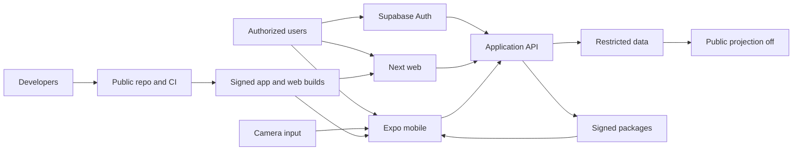

# WhiteRabbit Threat Model

- Date: 2026-08-13
- Branch reviewed: `main`
- Runtime status: planned; the repository currently contains documentation, memory
  tooling, tests, hooks, and GitHub workflows, but no product application or backend
- Review target: Specification 0003 synthetic Defence pilot and its planned architecture

## Executive summary

WhiteRabbit's highest risks arise from combining internet-reachable government
multi-tenancy with edge camera nodes, plate observations, biometric watchlists, and
high-consequence human review. The critical themes are cross-tenant authorization,
watchlist/governance abuse, stolen or malicious nodes, false biometric candidates,
evidence or template leakage, and supply-chain substitution of models or builds. The
repository already documents fail-closed boundaries and checks memory/CI hygiene, but
none of the runtime controls exist yet; they are release requirements, not current
mitigations.

## Scope and assumptions

In scope:

- current repository governance and CI: `AGENTS.md`, `SECURITY.md`, `.github/`,
  `.codex/`, `scripts/memory/`, `tests/`, `PROJECT_SPEC.md`, `docs/`, and `memory/`;
- planned Expo mobile node, Next.js command center, application API, synthetic
  Supabase control plane, Vercel preview, edge inference, signed packages/events,
  watchlists, evidence, review, audit, and disabled public projection described in
  `docs/architecture/0001-system-architecture.md` and Specs 0002–0004;
- the public source/build/release path and separately licensed future model artifacts.

Out of scope:

- the ignored `sparrowmap/` research checkout as a running or vendored component;
- real Defence, police, municipal, intelligence, or classified infrastructure/data;
- operational camera locations, network topology, response procedures, credentials,
  watchlists, identities, footage, and model weights;
- later circles/bridges/federation, except as an explicitly deferred escalation risk.

Assumptions validated with the project owner:

- Defence is first, but profiles remain isolated for police and municipalities;
- the first implementation target is one fictional `BE-DEFENCE-ADMIN` site with
  1–10 iPhones and at most 1,000 generated watchlist identities;
- only synthetic data is used; restricted synthetic candidate crops expire within
  24 hours; public projection and federation are off;
- human auth is Supabase email/password without SSO; privileged roles require MFA;
- mobile is Expo/React Native foreground `Sentry Mode`; desktop is Next.js;
- Supabase/Vercel are candidates only for synthetic or formally approved data.

Open questions that could materially change risk ranking:

- Which exact authority service owns the real pilot and what legal/classification,
  hosting, network-exposure, and response approvals will apply?
- Will a future production control plane be public-internet reachable, private-network
  only, or separated per authority, and at what node/operator/watchlist scale?
- What minimum device/security tier, hardware key protection, attestation, MDM, build
  distribution, and incident-response controls will the controller require?
- Which exact model/runtime artifacts, licences, calibration population, and liveness
  or presentation-attack controls will be approved?

## System model

### Primary components

- **Current repository/CI:** public AGPL source, GitHub workflows, dependency-free
  Python memory tooling, lifecycle hooks, and tests. Evidence:
  `.github/workflows/ci.yml`, `.github/workflows/release.yml`,
  `scripts/memory/memory_tool.py`, `tests/test_memory_tool.py`.
- **Planned mobile edge:** Expo development build, camera lifecycle, device key,
  signed packages, bounded local inference, encrypted outbox, and health. Evidence:
  `docs/architecture/0001-system-architecture.md`, `docs/specs/0003-synthetic-defence-pilot.md`.
- **Planned command center/API:** Next.js UI plus server authorization for deployment,
  candidates, watchlists, nodes, policy, retention, and audit. Evidence:
  `docs/design/0001-product-experience.md`, `docs/specs/0004-signed-event-and-api-contract.md`.
- **Planned synthetic control/data plane:** Supabase Auth/Postgres/RLS/private Storage
  and optional Vercel UI preview; restricted cells replace these where required.
  Evidence: `memory/decisions/ADR-0006-native-mobile-and-supabase-auth.md`,
  `docs/architecture/0001-system-architecture.md`.
- **Planned ML supply chain:** separately approved detector/ALPR/embedder artifacts,
  signed model registry, and scoped watchlist packages. No dependency or weights exist
  today. Evidence: `docs/specs/0002-biometric-watchlists.md`,
  `docs/research/0001-biometric-watchlist-options.md`.

### Data flows and trust boundaries

- Developer → public repository/CI: source, specs, workflows, tags, and release
  metadata cross Git over authenticated GitHub channels. Existing guarantees are
  branch/account controls outside the repo plus CI tests, secret-pattern checks for
  managed memory, explicit staging rules, and review. Arbitrary code/dependency/model
  provenance enforcement is not yet implemented. Evidence: `AGENTS.md`,
  `.github/workflows/ci.yml`, `.github/workflows/release.yml`.
- Human user → Supabase Auth: email/password, recovery, refresh tokens, and TOTP cross
  TLS. Planned guarantees are Supabase session validation and `aal2` for privileged
  actions. Runtime session hardening is not implemented. Evidence:
  `memory/decisions/ADR-0006-native-mobile-and-supabase-auth.md`, Spec 0004.
- User client → application API: filters, reviews, watchlist changes, enrollment,
  evidence grants, and audit queries cross HTTPS. Planned guarantees are JWT
  verification, server-resolved membership, RLS/application authorization, strict
  schemas, concurrency/idempotency, classification rules, and rate limits. No endpoint
  exists yet. Evidence: Spec 0004.
- Camera → mobile edge pipeline: untrusted frames and image metadata cross local
  native/JavaScript boundaries. Planned guarantees are permission, capture mask,
  bounded buffers, parser/resource limits, local minimization, and lifecycle stop.
  Native adapters/models are not selected or sandboxed yet. Evidence: Architecture
  0001, Spec 0003.
- Control plane → node: desired state plus signed/encrypted policy, model, and watchlist
  packages cross HTTPS. Planned guarantees are device proof, signature/digest,
  deployment/purpose/node/model/expiry scope, rollback protection, and revocation.
  Package services do not exist. Evidence: Architecture 0001, Specs 0002 and 0004.
- Node → ingest/API: minimal signed heartbeats, ALPR/object observations, and biometric
  candidates cross HTTPS. Planned guarantees are independent device signature,
  canonical schema, server-resolved scope, counter/digest anti-replay, policy, and
  idempotency checks. Ingest does not exist. Evidence: Spec 0004.
- API → Postgres/private Storage: operational metadata, reviews, audit, and expiring
  synthetic evidence cross provider channels. Planned guarantees are least-privilege
  service identities, RLS, private buckets, encryption, per-object grants, 24-hour
  deletion, and separate biometric permissions. Schema/policies do not exist. Evidence:
  Spec 0003, Architecture 0001.
- Restricted operational plane → public projection: only a distinct policy-approved,
  minimized projection may cross. It is disabled for the pilot and biometrics have no
  route. No projector exists. Evidence: `AGENTS.md`, Specs 0001–0003.

#### Diagram

## Assets and security objectives

| Asset | Why it matters | Security objective (C/I/A) |
| --- | --- | --- |
| Human credentials, sessions, recovery and MFA factors | Account takeover can expose or alter high-consequence data | C, I, A |
| Deployment membership, roles, purposes, policies and classification | This is the authorization truth and controller boundary | I, A, C |
| Node private keys, enrollment claims and counter state | Compromise permits forged observations or node impersonation | C, I, A |
| Signed policy/model/watchlist packages and revocations | Tampering can enable unauthorized matching or stale policy | I, A, C |
| Reference records, face templates and subject references | Biometric compromise is persistent and may harm real people | C, I |
| Raw frames, crops, plate data and embeddings | Highly sensitive inputs must remain local or tightly expired | C, I |
| Minimal ALPR/object/biometric candidate events | False or leaked observations can create tracking and response harms | C, I, A |
| Review decisions and current candidate state | Integrity determines what humans believe and what may be actioned | I, A, C |
| Evidence objects, encryption keys and deletion state | Leakage or failed expiry violates the pilot boundary | C, I, A |
| Audit trail and security telemetry | Needed for accountability, incident response and tamper detection | I, A, C |
| Models, weights, thresholds, licences and evaluation evidence | Substitution can change accuracy, legality and compatibility | I, A, C |
| Source, dependencies, workflows, builds and releases | Supply-chain compromise reaches every node/operator | I, A, C |
| Service availability, queues, device thermal/power budget | Loss or overload creates blind spots or unsafe stale UI | A, I |
| Tenant isolation and public-projection separation | Failure can expose one authority's data to another or the public | C, I |

## Attacker model

### Capabilities

- An unauthenticated internet attacker can reach future public auth/web/API surfaces,
  send malformed/large requests, enumerate behavior, phish users, and exploit exposed
  dependencies when those surfaces are deployed.
- A compromised `aal1` or privileged account can exercise all UI/API functions
  available to its role and attempt tenant-ID manipulation, stale sessions, confused
  deputy actions, evidence exfiltration, or governance abuse.
- A malicious or coerced tenant insider may have legitimate node, reviewer, maker,
  checker, admin, support, or audit access and understand operational workflows.
- A thief can physically obtain an enrolled old iPhone, inspect local storage, replay
  traffic, replace an unlocked build, obstruct/spoof the camera, or deny power/network.
- A malicious node can generate validly signed but false observations if its key and
  runtime are compromised.
- A supply-chain attacker may target a maintainer, dependency, build workflow, model,
  weight file, package manifest, or release artifact.
- A photographed subject or vehicle may present print/screen/replay/adversarial inputs
  to cause false negatives, false positives, or resource exhaustion.

### Non-capabilities

- The current repo contains no product service, production secrets, real model
  weights, watchlists, footage, or government infrastructure to attack directly.
- A remote attacker is not assumed to break modern TLS, platform cryptography, or
  Supabase/GitHub internals without another compromise.
- An attacker is not assumed to have classified-network access, MDM authority, cloud
  console ownership, or physical node access unless the specific threat says so.
- An unprivileged user is not assumed to know opaque IDs; authorization must still
  hold if IDs are discovered, so obscurity does not reduce cross-tenant severity.

## Entry points and attack surfaces

| Surface | How reached | Trust boundary | Notes | Evidence (repo path / symbol) |
| --- | --- | --- | --- | --- |
| Public Git and pull/commit path | GitHub contributor/maintainer | developer → repo | Current; code/workflow/model provenance risk | `AGENTS.md`; `.github/workflows/ci.yml` |
| Release workflow | GitHub tag/workflow dispatch | repo → release artifact | Current workflow; product signing/SBOM not yet defined | `.github/workflows/release.yml` |
| Memory CLI/hooks | local CLI and Codex lifecycle JSON | local tool input → filesystem | Current; path/content/secret handling | `scripts/memory/memory_tool.py`; `.codex/hooks/` |
| Human auth/recovery/MFA | mobile/web over internet | user → Supabase Auth | Planned; phishing, enumeration, session theft, recovery | ADR-0006; Spec 0004 |
| Application API | HTTPS routes | user client → API | Planned; tenant/authz/schema/DoS boundary | `docs/specs/0004-signed-event-and-api-contract.md` |
| Camera/native frame adapter | device camera and local media | physical scene → node | Planned; malicious images, parser and resource pressure | Architecture 0001 |
| Node enrollment/deep link | QR/universal link | admin claim → untrusted device | Planned; claim theft, wrong deployment, key substitution | Spec 0003; Spec 0004 |
| Package manifest/content | node HTTPS pull | control plane → node | Planned; rollback, substitution, scope leak | Spec 0002; Spec 0004 |
| Signed event ingest/outbox | node HTTPS batch | node → ingest | Planned; replay, fork, forged semantic data, flood | Spec 0004 `SignedNodeEvent` |
| Evidence upload/retrieval | private object API | node/API/user → Storage | Planned; parser, ACL, signed URL, retention, exfiltration | Spec 0003 `Data Rules`; Spec 0004 |
| Watchlist governance | privileged web/API | insider → restricted domain | Planned; unlawful enrollment, self-approval, bulk access | Spec 0002 `Watchlist Governance` |
| Realtime/telemetry/logging | provider channels and dashboards | runtime → support/observability | Planned; leakage, stale authority, high-cardinality DoS | Architecture 0001 |
| Public projection | projection job/API | restricted → public | Planned but disabled; catastrophic if accidentally joined | `AGENTS.md`; Spec 0001 |

## Top abuse paths

1. **Cross-tenant evidence theft:** attacker compromises an account, substitutes a
   deployment/resource ID, reaches a missing API/RLS check, obtains an evidence grant,
   and downloads another authority's candidate crop or event history.
2. **Watchlist governance capture:** privileged insider creates or imports an
   unauthorized subject, circumvents independent checker enforcement, widens node/site
   scope or expiry, distributes the package, and generates targeted candidate alerts.
3. **Stolen node impersonation:** thief extracts or uses the device key, replays or
   fabricates signed events, exploits weak counter reset/revocation handling, and makes
   reviewers trust false location observations.
4. **Model/package substitution:** attacker compromises CI, storage, signing, or a
   maintainer; replaces a detector/embedder or threshold package; nodes accept it due
   to weak digest/rollback checks; accuracy and watchlist compatibility silently change.
5. **False biometric escalation:** an adversarial image or lookalike passes quality and
   corroboration; biased/uncalibrated scoring produces a candidate; UI language or
   procedure treats it as identification; a human takes an unjustified adverse action.
6. **Evidence retention bypass:** candidate media enters logs, analytics, backups,
   crash reports, cached URLs, or orphaned objects; the database row expires but copies
   remain retrievable beyond 24 hours.
7. **Public-plane join:** a developer or analyst reuses an operational query/view,
   misclassifies an event or exposes a foreign key, and publishes restricted plate,
   node, military/police, or biometric-linked data.
8. **Account/recovery compromise:** phishing, password reuse, recovery abuse, or stolen
   refresh token yields a privileged session; missing `aal2` server checks allow node,
   watchlist, evidence, or review changes.
9. **Resource/blind-spot attack:** high-rate scenes, crafted media, oversized batches,
   or API floods exhaust phone thermal/battery/storage or cloud queues; health becomes
   stale and operators incorrectly assume coverage continues.
10. **Future federation escalation:** a broadly scoped bridge is presented as a group
    merge; historic records or biometric references cross controller boundaries and
    revocation cannot retract prior access. Federation is excluded from the pilot.

## Threat model table

| Threat ID | Threat source | Prerequisites | Threat action | Impact | Impacted assets | Existing controls (evidence) | Gaps | Recommended mitigations | Detection ideas | Likelihood | Impact severity | Priority |
| --- | --- | --- | --- | --- | --- | --- | --- | --- | --- | --- | --- | --- |
| TM-001 | Remote attacker or compromised tenant user | Product API exists and an ID/RLS/application check is missing or inconsistent | Read or mutate another deployment's events, evidence, roles, nodes or watchlist | Cross-authority breach and controller/regime conflation | Tenant isolation, evidence, watchlists, roles, audit | Fail-closed profile/data-plane requirements are specified (`AGENTS.md`; Specs 0001, 0004), not implemented | No schema, RLS, API authz or isolation tests exist | Server-resolve tenant from verified actor/resource; deny-by-default RLS plus application checks; separate biometric cells; two-tenant negative tests for every operation | Alert on cross-tenant policy denials, unusual ID scans, evidence grants, role changes and service-role use | high once exposed | high | critical |
| TM-002 | Malicious/coerced admin, maker or checker | Legitimate privileged access or compromised `aal2` session | Enroll unauthorized subject, self-approve, widen scope/expiry or suppress revocation | Targeted mass surveillance and unlawful alerts | Watchlists, authority state, packages, subjects | Maker-checker, provenance, scope and expiry are specified (Spec 0002), not implemented | No independent approval engine, category allowlist or immutable audit | Enforce distinct maker/checker identities transactionally; signed authority; category/site/node/time allowlists; emergency revoke; periodic recertification; prohibit bulk/OSINT import | Alert on self/rapid approvals, scope growth, expiry extension, unusual package size/download and revoke failures | medium | high | critical |
| TM-003 | Supply-chain attacker or maintainer compromise | Ability to alter dependency, model, weight, build workflow, package or release | Ship malicious/incompatible runtime or silently change model/threshold | Device compromise, false events, licence breach and invalid evaluation | Builds, models, keys, events, devices | Public review, AGPL notices, CI memory tests and model provenance gates are documented (`.github/workflows/ci.yml`; `AGENTS.md`; Spec 0002) | No lockfile/SBOM, artifact signing, reproducible build, model registry or binary provenance yet | Pin dependencies/digests; separate model/weight licence review; signed SBOM/provenance; protected release environment; two-person release; verify package/model signatures and rollback counters on node | Compare deployed digests to registry; alert on unknown signer/digest, rollback and build/release changes | medium | high | critical |
| TM-004 | Device thief, malicious node operator or mobile compromise | Physical/unlocked device, exploitable native module, exported key or weak revocation | Use key to decrypt packages or sign false observations; inspect outbox/watchlist | Forged tracking, watchlist disclosure and persistent biometric harm | Node key, packages, outbox, events | Separate node identity, expiry/revocation and bounded outbox are specified (ADR-0006; Architecture 0001), not implemented | Secure key capability, attestation, MDM, device baseline and wipe behavior undecided | OS-protected non-exportable keys; supported-device security floor; local encryption; jailbreak/integrity signals as risk input; rapid revoke/rotate; minimal packages; no offline evidence beyond TTL | Impossible travel/node duplication, signature from revoked key, counter forks, attestation change, abnormal package pulls and offline duration | medium | high | critical |
| TM-005 | Malicious/compromised node or network replay actor | Valid key, captured traffic or counter-reset weakness | Replay, reorder, fork or fabricate semantically false signed events | Reviewers trust false time/location/entity observations | Event integrity, review state, audit | Canonical signature/counter/digest validation is specified (Spec 0004), not implemented | Signing does not prove camera truth; no attestation or cross-sensor corroboration selected | Atomic high-water counters and hash chain; signed epoch rotation; quarantine gaps/forks; server receipt time; attestation where approved; human/corroboration context; signed build/model state | Alert on duplicate IDs, digest conflict, counter reset/gap/fork, clock skew, node location/health anomalies | medium | high | high |
| TM-006 | Physical adversary, biased model, poor environment or fatigued reviewer | Real biometric mode or synthetic workflow is treated as production; weak calibration/UX | Spoof or cause a false candidate that is interpreted as identity/action authority | Wrong-person intervention, discrimination and loss of rights | Subjects, review decisions, model evidence, reputation | Candidate-only terminology, human review and evaluation gates are specified (`docs/design/0001-product-experience.md`; Spec 0002), not implemented | No approved model, threshold, PAD/liveness, representative evaluation, training or response procedure | Deployment-specific FPIR/FNIR and subgroup evaluation; presentation-attack controls; independent corroboration; two-person review where needed; prohibit automated adverse action in policy/API; clear uncertainty UI | Monitor candidate/reject/inconclusive rates by device/environment and approved fairness slices; reviewer override/fatigue patterns; incident feedback loop | high in uncontrolled conditions | high | critical |
| TM-007 | Remote attacker, support insider or developer error | Evidence exists in storage/logs/cache/backups with weak ACL or deletion | Retrieve, duplicate or retain crops/templates/plates beyond purpose and 24-hour pilot TTL | Irrevocable biometric/privacy breach and noncompliance | Evidence, templates, keys, deletion state | Minimal evidence/private expiry rules are specified (Spec 0003; Architecture 0001), not implemented | No bucket policy, KMS design, backup deletion, cache/log inventory or deletion proof | Separate evidence service/bucket/key domain; short one-use grants; deny CDN/public URLs; content scanning/decoding; deletion ledger and orphan sweeper; log/crash/backup exclusions and restore-time deletion replay | Reconcile DB/object/KMS inventories; alert on expired-object access, grant spikes, orphan objects, backup restore and support access | medium | high | critical |
| TM-008 | Developer, analyst or misconfiguration | Public plane exists or an operational source is queried directly | Project restricted or biometric-linked fields to an internet/public surface | Exposes operations, subjects, nodes or protected movements | Public boundary, events, locations, watchlists | Separate projection and biometric no-route rule are explicit (`AGENTS.md`; Spec 0001); pilot projection is disabled (Spec 0003) | No physical schema/account/network separation or projection tests exist | Separate datastore/service identity/API/domain; allowlisted projection schema; policy proof and human review; delay/coarsen; canary fields; forbid joins to biometric/node/evidence domains | Continuous public payload scanner; alert on schema drift, forbidden fields/joins, unusual volumes and emergency takedown use | low in pilot, medium later | high | critical |
| TM-009 | Phisher, credential stuffer or recovery attacker | Internet auth and weak password/session/recovery controls | Obtain privileged session and change nodes, watchlists, evidence grants or reviews | Broad integrity/confidentiality compromise | Credentials, roles, sessions, watchlists, evidence | Supabase Auth and `aal2` privileged actions are selected (ADR-0006; Spec 0004), not implemented | No password/MFA/recovery/session/device policy, CSRF/origin review or admin break-glass design | Mandatory TOTP for privileged roles; short privileged session; server-side AAL check; secure refresh storage; recovery throttling/notifications; reauth for high-risk actions; admin device/session view and revoke | Credential-stuffing, impossible travel, recovery/MFA changes, new device, privilege step-up failures, grant/export spikes | high | high | critical |
| TM-010 | Remote flooder, crafted scene or malicious node | Reachable API/camera and finite phone/cloud resources | Exhaust CPU, memory, thermal, battery, storage, parser or queue capacity | Blind spots, data loss, stale health and unsafe operator belief | Availability, outbox, health, review queues | Bounded buffers, health states and rate policy classes are specified (Architecture 0001; Spec 0004), not implemented | No measured limits, load shedding, circuit breakers, quotas or capacity tests | Per-stage budgets; bounded queues/TTL; adaptive frame sampling; safe thermal stop; per-node/tenant/global rate limits; request size/decompression limits; priority lane for revoke/health; staleness UI | Thermal/queue/drop/latency dashboards, stale-heartbeat alarms, rate-limit saturation, parser crashes and cost anomalies | high | medium | high |
| TM-011 | Malicious file/media/package author | Ability to submit evidence, image metadata, model/package bytes or crafted camera content | Exploit unsafe decoder/native inference parser or path/archive handling | Node/server code execution, crash or data exfiltration | Devices, API, storage, builds, keys | Content-type/size/digest and parser fuzz requirements are specified (Specs 0003, 0004), not implemented | Native adapter, decoder, upload and model loaders unselected and unsandboxed | Allowlist formats; decode/re-encode in constrained worker; never trust extension/MIME; no archives; size/dimension/decompression caps; fuzz native boundaries; signed model/package content only | Crash clustering by digest/source, parser time/memory alarms, quarantine repeated malformed content | medium | high | high |
| TM-012 | Insider, developer or future federation partner | Circles/bridges are implemented with broad scope or historic merge semantics | Expand sharing across controllers, retain copies after revoke or introduce cross-tenant search | Regime conflation and irreversible dissemination | Tenant isolation, events, watchlists, audit | Explicit prospective scoped bridges/no merge are specified (`AGENTS.md`; ADR-0004); federation is excluded from pilot | No bridge protocol, recipient enforcement, deletion proof or downstream revocation exists | Keep out of initial runtime; new ADR/threat model/DPIA; schema allowlists; bilateral signed purpose/expiry; no biometric bridge; recipient-side enforcement and revocation receipts | Bridge creation/scope/volume/expiry alerts, downstream access attestations, failed revocation reconciliation | low in pilot | high | medium |
| TM-013 | Contributor, automation or compromised workstation | Sensitive context enters managed memory, Git history, CI logs or a public issue | Commit credentials, operational details, private locations or personal data | Permanent public disclosure and incident response | Source history, secrets, operational metadata | Memory secret scanning, no-transcript rule, explicit staging and tests exist (`scripts/memory/memory_tool.py`; `tests/test_memory_tool.py`; `AGENTS.md`) | Pattern scan is incomplete; no repository-wide secret scanner or DLP; public Git history is durable | Repository-wide secret scanning/pre-receive/CI; sample-data policy; synthetic fixture generator; path ownership; contributor training; rapid credential rotation and history-remediation playbook | GitHub secret scanning, CI DLP patterns, review alerts for binary/media/config files and operational vocabulary | medium | high | high |

## Criticality calibration

- **Critical:** plausible compromise that crosses an authority/tenant boundary, enables
  unlawful watchlist processing, exposes non-replaceable biometrics, ships a malicious
  model/build fleet-wide, or makes a false biometric candidate drive serious human
  action. Examples: TM-001 cross-tenant access, TM-002 watchlist abuse, TM-006 false
  biometric escalation.
- **High:** material compromise of one deployment/node or sustained loss of integrity/
  availability with no proven fleet-wide or cross-controller effect. Examples: TM-005
  signed semantic forgery, TM-010 resource exhaustion, TM-011 parser/native exploit.
- **Medium:** bounded pilot-only or deferred risk requiring a feature not yet in scope,
  with strong detection/recovery possible and no sensitive data disclosure by itself.
  Examples: TM-012 future federation escalation; a temporary synthetic-only node
  outage that is clearly shown as stopped.
- **Low:** minor security/usability weakness without authorization bypass, sensitive
  disclosure, durable integrity loss, or meaningful availability impact. Examples:
  imprecise synthetic-only diagnostic metadata or a non-sensitive audit-view layout
  issue. No top threat currently relies on a low-only classification.

The ranking assumes future internet exposure and real high-sensitivity use are
possible. If production is physically isolated with managed devices and no biometrics,
likelihood drops for remote/account threats; insider, supply-chain, and false-result
impact remain high.

## Focus paths for security review

| Path | Why it matters | Related Threat IDs |
| --- | --- | --- |
| `AGENTS.md` | Repository-wide security/privacy and publication invariants | TM-003, TM-008, TM-012, TM-013 |
| `docs/specs/0001-belgian-controller-profiles.md` | Controller/classification/public boundary | TM-001, TM-008, TM-012 |
| `docs/specs/0002-biometric-watchlists.md` | Biometric authority, watchlist and human-review invariants | TM-002, TM-006, TM-007 |
| `docs/specs/0003-synthetic-defence-pilot.md` | Exact data, node, retention and no-public pilot scope | TM-004, TM-007, TM-010 |
| `docs/specs/0004-signed-event-and-api-contract.md` | Authz, signature, anti-replay, evidence and API choke points | TM-001, TM-005, TM-009, TM-010, TM-011 |
| `docs/architecture/0001-system-architecture.md` | Trust boundaries, identities, pipelines, cells and provider split | TM-001, TM-004, TM-007, TM-008 |
| `docs/design/0001-product-experience.md` | Candidate uncertainty, privileged UX and stale/health presentation | TM-006, TM-009, TM-010 |
| `memory/decisions/ADR-0006-native-mobile-and-supabase-auth.md` | Human/node identity split and phase-1 auth assumptions | TM-004, TM-009 |
| `docs/research/0001-biometric-watchlist-options.md` | Model/runtime licence and feasibility evidence | TM-003, TM-006, TM-011 |
| `.github/workflows/ci.yml` | Current integrity gate and future dependency/security checks | TM-003, TM-013 |
| `.github/workflows/release.yml` | Public release authority and future artifact provenance/signing | TM-003 |
| `scripts/memory/memory_tool.py` | Current filesystem/content validation and secret-pattern handling | TM-013 |
| `.codex/hooks/` | Automated local input and repository-memory lifecycle | TM-013 |
| `tests/` | Current security regression evidence and future negative-test location | TM-001, TM-005, TM-013 |
| `packages/contracts/` | Planned parser/signature/schema boundary; review once created | TM-001, TM-005, TM-010 |
| `packages/policy/` | Planned fail-closed authority and transition decisions | TM-001, TM-002, TM-008 |
| `apps/mobile/` | Planned camera, key, package, outbox and native inference boundary | TM-004, TM-005, TM-010, TM-011 |
| `apps/web/` | Planned session, authorization, evidence and reviewer boundary | TM-001, TM-006, TM-009 |
| `supabase/` | Planned RLS, storage, retention and audit enforcement | TM-001, TM-007, TM-008, TM-009 |

## Quality check

- [x] Current repository/CI and planned runtime entry points are separated.
- [x] Every documented trust boundary appears in at least one threat or abuse path.
- [x] Attacker-controlled, operator-controlled, developer-controlled, and physical
      inputs are distinguished.
- [x] The project owner's deployment, auth, mobile, scale, synthetic-data, retention,
      and UI clarifications are reflected.
- [x] Planned controls are labeled as unimplemented; current controls have repo paths.
- [x] Open controller, exposure, device, model, hosting, and response questions remain
      explicit because they can change likelihood or deployment topology.
